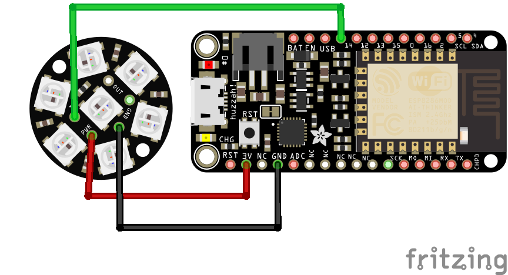

# Magic Crystal

A simple magic crystal to alert the on-the-go witch to events to be mindful of. :sparkles:

## Features

* Glows red when mercury is in retrograde
* Glows white when the moon is full
* Breathes slowly otherwise

## Parts and Supplies

* [Crystal Mold](https://www.amazon.com/Quartz-Crystal-Soap-Candle-Mold/dp/B01MDUXPK4) (I used this one but any works)
* Resin Epoxy
* [Feather Huzzah with ESP8266](https://www.adafruit.com/product/2821)c
* [Neopixel Jewel](https://www.adafruit.com/product/2226) 
* 3D print of the base.stl
* USB cable and USB => power adapter
* Sandpaper (optional)
* Velcro (optional)
* E6000 (optional)

## Process: 

1. Solder 3 wires to the pins of the Neopixel Jewel (power, ground, in) - either use separate colors for these or be mindful of which goes to which and mark with tape. Either way you will need some way to tell them apart. 
2. Mix the resin epoxy based on what the instructions specify 
3. Pour into mold and leave some space to insert the neopixel jewel. Make sure the seal the jewel in space with resin above it and that wires are long enough and out of the mold itself. 
4. (Optional) Sand the surface of the crystal with the sandpaper to allow for more LED diffusion
5. Wait the specified time for the resin to cure and remove your faux crystal from the mold.
6. Set the crystal on the base and feed the wires through the hole in the middle. 
7. Solder the wires onto the feather in ground, 3V, and 14 such that ground => ground, power => 3V, and 14 => in
8. (Optional) Place velcro on the base and the huzzah to keep both in place
9. (Optional) Glue the crystal to the base with the E6000 glue
10. Change the code to have your SSID and password
11. Follow [these instructions](https://learn.adafruit.com/adafruit-feather-huzzah-esp8266/using-arduino-ide) to prepare your computer to upload the code
11. Upload the code using Arduino IDE
12. :tada: Plug in the USB cable with the adapter and plug into the wall

